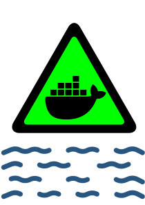

# MI PRIMER LABORATORIO





## Diviértete creando , jugando y haciendo mi3rda todo, en este simpático laboratorio montado con Docker Compose.

### Instrucciones :

Clonar este repositorio

Darle todos los permisos

```
sudo chmod 777 -R laboratorio
```

Ingresar al repositorio
```
cd laboratorio
```
Construir la imagen de kali

```
docker build -t kali-custom ./
```

Instalar el complemento

```
sudo apt install cpu-checker
```

Levantar el laboratorio y listo

```
docker compose up -d --build
```

## SCADA CORE

### 1. Crear estructura de directorios SCADA:

```
mkdir -p scada/{node-red-data,mosquitto/{config,data,log},plc-programs,influxdb-data,grafana/data}
```

### 2. Crear configuración Mosquitto:

```
cat > scada/mosquitto/config/mosquitto.conf << 'EOF'
listener 1883 0.0.0.0
allow_anonymous true

listener 9001 0.0.0.0
protocol websockets

log_dest file /mosquitto/log/mosquitto.log
log_dest stdout

persistence true
persistence_location /mosquitto/data/
EOF
```

### 3. Ejecutar solo los servicios SCADA:

```
docker-compose up -d --build dns_server host_a scada-core mqtt-broker plc-simulator scada-db scada-dashboard
```


